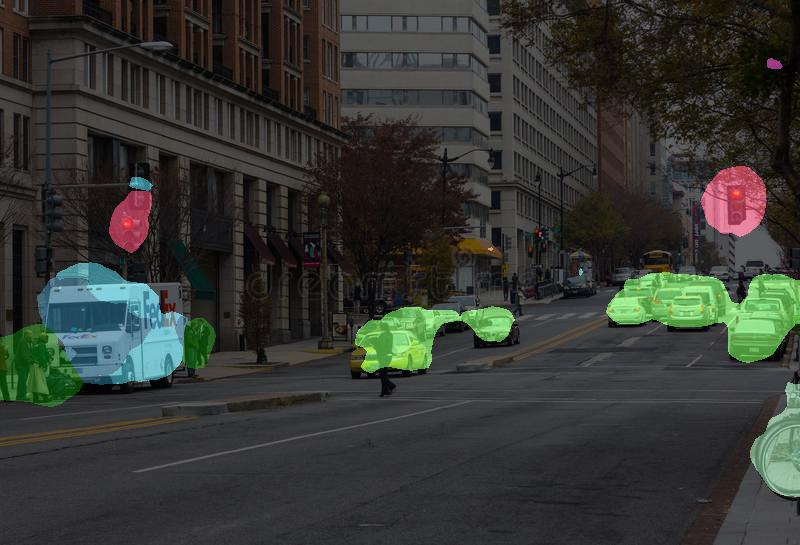
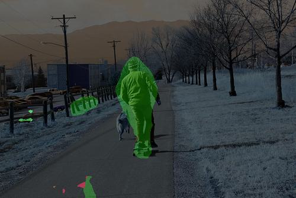

# COCO segmentation in Pytorch
This repository contains a pytorch implementation of an image segmentation algorithm known as Fully Convolution Network(FCN) for segmenting images in COCO Dataset. Following are the results after training the network on COCO Dataset.

<p align="center">
    
</p>
<p  align="center">
    
</p>
<p  align="center">
    
</p>

## Requirements
The program is written in Python, and uses [pytorch](http://pytorch.org/), [numpy](https://numpy.org/), [opencv](https://opencv.org/), gputils, pycocotools. 

## Usage
### Dataset
Download links for datasets
- COCO [Train Images](http://images.cocodataset.org/zips/train2017.zip) [118k/18GB]
- COCO [Train Images](http://images.cocodataset.org/zips/val2017.zip) [5k/1GB]
- COCO [Annotations](http://images.cocodataset.org/annotations/stuff_annotations_trainval2017.zip) 

### Training
Following is the command to start training if using default parameters and dataset and repo is downloaded in current directory.
But you can change those parameters according to your needs.
```
python coco_segmentation/train.py 
```
* `--root_dir`: path to directory where you have downloaded images and annotations.
* `--image_set`: image set that you are using 'train' or 'val.
* `--val_split`: validation split value for the dataset, number between 0 and 1
* `--size`: training image size
* `--num_classes`: number of classes for segmentation for COCO dataset it is 91 by default including background.
* `--batch_size`: mini-batch size.
* `--epochs`: number of epochs to train.
* `--lr`: learning rate.
* `--log_folder`: name to be appended to log folder name of that session
* `--model_dir`: name of the directory where model is to be saved.
* `--finetune`: flag to fine tune model on dataset if 'True' the model weigths are frozen and then trained.
* `--resume`: path to the saved model to continue training.
 
The above results are not that good because I have trained for small number of epochs and 'val' set which has only 5k images because of limited
compute.
